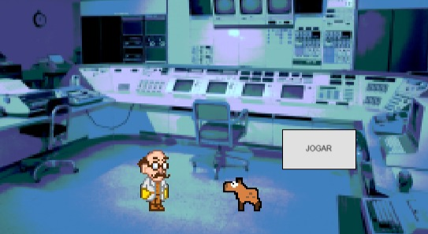
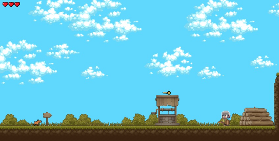
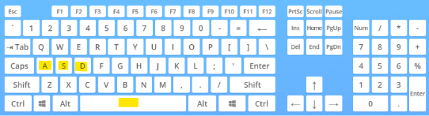

# As aventuras de Lysa

## Projeto
Este foi o primeiro trabalho realizado no curso de Ciência da Computação, na disciplina Experiência Criativa e consistiu na criação de um jogo utilizando o Construct 3. O jogo trata das aventuras de uma inocente capivara que foi raptada do parque Barigui pelo terrível doutor Nefários que a utiliza como cobaia para testar a sua máquina do tempo, enviando ela para diversas épocas ao longo da história. Nenhum dos membros da equipe tinha experiência prévia com a criação de jogos. Apesar disso, este foi um dos melhores jogos da sala, e o melhor sem fazer uso da versão premium do Construct 3, a qual contava com muitas facilidades extras. Como fizemos uso apenas a versão gratuita, tivemos que limitar um pouco as funcionalidades do jogo que havíamos idealizado inicialmente, mas para o usuário final, não é possível notar nenhuma diferença, e ele parece um jogo completo e funcional. A limitação trouxe criatividade na hora de solucionar os problemas, e ter que lidar com isso deixou ele mais interessante de ser feito. Hoje, este jogo é utilizado como exemplo para os calouros pelo professor desta disciplina.

 
 
 

## Documento
Para ler o documento do projeto, abra o arquivo "GDD".

## Como rodar
Para jogar, acesse o [Construct 3](https://www.construct.net/en), crie uma conta, lance o aplicativo, importe o projeto "Jogo.c3p" e o execute no botão de play.
Os comandos para jogar são as teclas 
 - "a" e "d": direcionais
 - "s": golpe
 - "espaço": pulo 
 

